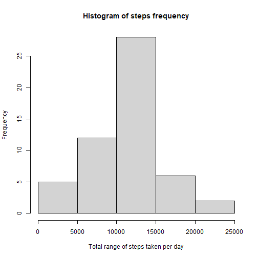
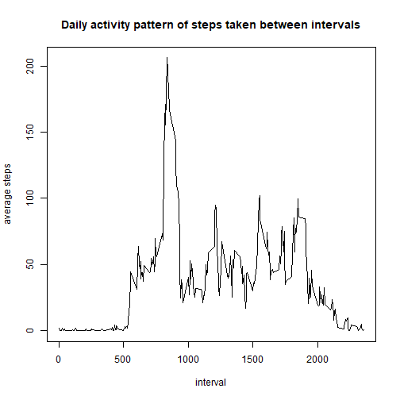
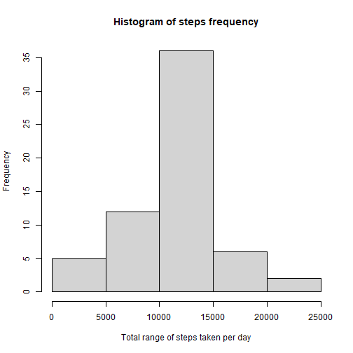
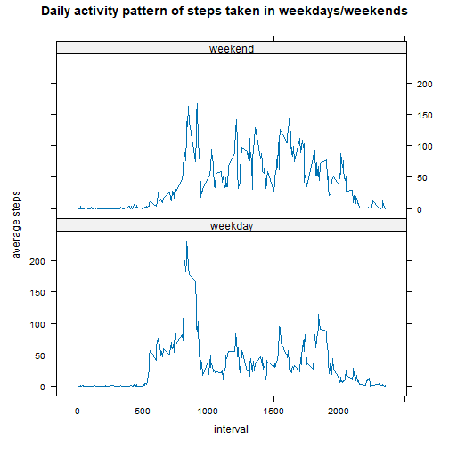

## Loading and preprocessing the data
Load the data using read.csv().

``` r
data <- read.csv("activity.csv")
data$date <- as.Date(data$date, "%Y-%m-%d")
```


## What is mean total number of steps taken per day?
First, remove NA values from the steps column.

``` r
without_na <- na.omit(data)
```

Then, use dplyr package to summarise the total number of steps each day.

``` r
library(dplyr)
total_steps <- without_na %>%
      group_by(date) %>% 
      summarise(total = sum(steps))
```

Lastly, use the summarised data to make a histogram.

``` r
hist(total_steps$total, 
     main = "Histogram of steps frequency",
     xlab = "Total range of steps taken per day")
```



Meanwhile, the mean and median of the total number of steps taken per day can both be found with summary().

``` r
summary(total_steps$total)
```

```
##    Min. 1st Qu.  Median    Mean 3rd Qu.    Max. 
##      41    8841   10765   10766   13294   21194
```
The mean is 10,766 steps per day and the median is 10,765 steps per day.

## What is the average daily activity pattern?
The data without missing values is grouped by interval while the average steps are calculated within those intervals. Then, a time series plot is created to see the daily activity pattern.

``` r
activity_pattern <- without_na %>% 
      group_by(interval) %>% 
      summarise(pattern = mean(steps))

with(activity_pattern, plot(interval, pattern, 
                            type = "l",
                            main = "Daily activity pattern of steps taken between intervals",
                            ylab = "average steps"))
```



The interval containing the maximum value can be easily found with the which() command, which is interval 835 with the average steps of 206.

``` r
activity_pattern[which.max(activity_pattern$pattern),]
```

```
## # A tibble: 1 × 2
##   interval pattern
##      <int>   <dbl>
## 1      835    206.
```


## Imputing missing values
The total number of rows with missing values can be calculated with sum() of is.na() in the original dataset that was loaded.

``` r
sum(is.na(data))
```

```
## [1] 2304
```

To replace the missing values, the mean for the 5-minute interval will be used. Using the previously created object to find the daily activity pattern, this object can be merged to the original dataset to replace the NA values according to the intervals.

``` r
replaced_data <- merge(data, activity_pattern, by = "interval")
replaced_data$steps <- ifelse(is.na(replaced_data$steps), 
                              replaced_data$pattern, replaced_data$steps)
replaced_data <- replaced_data[,1:3]
```

Then, the histogram is created with similar steps previously done.

``` r
total_steps_replaced <- replaced_data %>%
      group_by(date) %>% 
      summarise(total = sum(steps))

hist(total_steps_replaced$total, 
     main = "Histogram of steps frequency",
     xlab = "Total range of steps taken per day")
```



It is shown that the histogram is different to the previous one, as it pushes the distribution to become more "normal" (populated closer to the mean).

## Are there differences in activity patterns between weekdays and weekends?
The assignment of type of days can be easily achieved using the lubridate package.

``` r
library(lubridate)
replaced_data_days <- replaced_data %>% 
      mutate(day = ifelse(wday(date) %in% c(1,7), "weekend", "weekday"))
replaced_data_days$day <- as.factor(replaced_data_days$day)
```

Next, the data is grouped by interval and type of days. Using the lattice package, a time series plot for each type of days (weekday and weekend) can be constructed.

``` r
activity_pattern_days <- replaced_data_days %>% 
      group_by(across(c(interval, day))) %>% 
      summarise(pattern = mean(steps))

library(lattice)
xyplot(pattern ~ interval | day, 
       data = activity_pattern_days,
       type = "l", layout = c(1,2),
       main = "Daily activity pattern of steps taken in weekdays/weekends",
       ylab = "average steps")
```


